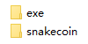
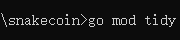

## SnakeCoin(1.0.0-Stable)

一个简单的区块链实现，希望能够给您提供参考，谢谢。

## 使用

### 准备


使用压缩工具进行解压，得到如下文件结构



① exe文件夹保存的是项目的.exe可执行文件。

② snakecoin文件夹保存的是项目的源代码文件。

### 运行

在exe文件夹下找到`snakecoin.exe`执行文件。


#### 第一步

第一步是初始化区块链，创建创世区块，生成相应的存储文件夹。

```go
snakecoin init
```


#### 第二步

第二步是新建一个账户。

## 代码调试

如果您想在自己的电脑上调试该项目，则阅读下列内容。

### 要求

因为该项目部分第三方包需要Go语言版本在`1.19`以上才能进行工作，所以您需要一个Go语言`1.19`以上的环境来运行项目。

### 下载第三方包

您可以在项目根路径使用如下命令进行下载项目所需的第三方包：

```go
go mod tidy
```

如图所示：

